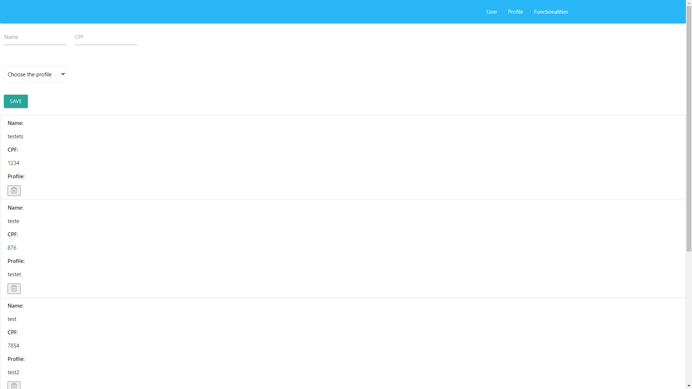

# Nome do produto
> Este é um projeto para teste de um CRUD, 
>utilizado .Net Core v3.1 para criar a API do Back-End, com documentação em Swagger para facilitar os testes e leitura dos endpoints, controlles e views
>Utilizadp React v16.13.1 para criar o Front-End juntamente com as biliotecas Axios e react-router-dom para navegação, Materializecss e React-icons para criar um visual bacana, 
>Para armazenar as informações foi utilizado o SQL Server 2019
>Para codificação foi utilizado o Visual Studio 2019 v16.4.5 e Visual Studio Code v1.43.2

[![NPM Version][npm-image]][npm-url]
[![Build Status][travis-image]][travis-url]
[![Downloads Stats][npm-downloads]][npm-url]

Badicamente o projeto consistem em cadastrar, um Usuário enviando nome, CPF e perfil.
Cada usuário tem somente um perfil que consistem em um tipo e quais as funções desse perfil, para cadastrar é necessário o envio do tipo do perfil e selecionar suas funções.
Cada perfil pode ter n funções, para cadastrar é necessário enviar o tipo de função.
Também é possivel deletar e atualizar esses registros.




## Criação do DB
Script de criaçao das tablelas e relacionamentos localizados em: https://github.com/dzampa/CRUD_Test/blob/master/SQL/script.sql
Primeiramente deve ter instalado uma versão do SQL Server, caso necessite pode ser baixado em: https://www.microsoft.com/pt-br/sql-server/sql-server-downloads
Abrir Microsoft SQL Server Management Studio e seguir os procedimento para criação de um DB com o nome CRUD_Test
Vamos iniciar criando um banco de dados usando T-SQL, então, com o Management Studio aberto, clique no botão New Query, como mostra a Figura 2.

Criando nova Query no Management Studio

Criando nova Query no Management Studio
Em seguida, na parte central da interface aparecerá uma tela em branco, na qual você poderá digitar os códigos para criar o banco de dados, tabelas, efetuar consultas, etc. 
Nesse momento, vamos executar o código a seguir e pressionar F5 ou clicar em Execute
CREATE DATABASE CRUD_Test
GO

Executando o script
Com o banco criado, precisamos entrar no seu contexto para poder executar novos scripts dentro dele
abrir o script de criação informado no ínicio a seguir e pressionar F5 ou clicar em Execute.
Com isso já teremos nosso banco e tablelas configuradas.

Será necessário a atualização da string de conecxão no projeto Back-End.


## Instalação Back-End

Códigos fonte localizado em: https://github.com/dzampa/CRUD_Test/tree/master/BACK/CRUD_TEST
Baixar e abir o projeto no Visual Studio 2019 e baixar todas as sua dependências utilizando o Manage NuGet Packages
ele poder ser acessado por meio do menu “TOOLS”, submenu “Library Package Manager” e, por fim, selecionando a opção “Manage NuGet Packages for Solution...”;
Clicando com o botão direito do mouse sobre a solução na janela Solution Explorer e escolhendo a opção “Manage NuGet Packages for Solution...”;
Repetindo o mesmo tipo de procedimento do passo anterior, só que desta vez com um clique com o botão direito do mouse sobre o projeto, dentro da janela Solution Explorer; acionar desta vez a opção “Manage NuGet Packages”.
Caso o nome dp DB tenha sido alterado é necessário atualizar a string de conecxão em ...\CRUD_Test\appsettings.Development.json
 "ConnectionStrings": {
    "CRUD_Test_APIContext": "Server={server.name};Database={DB.Namer};User ID={user};Password={password};Trusted_Connection=False;Packet Size=4096;"
  }
Para testar a aplicação em debug basta inicar com o F5 dentro do Visual Studio que o sistema irá simular um IIS e abrir a página do Swagger, com toda a documentação e endpois para serem avaliados.
Com isso já é possivel fazer requisicoes via Rest para o Back
Endereço inicial padrão do endpoint no meu caso é https://localhost:44306/api/ possa ser que a porta seja alterada
Caso desejar pode ser feita a publicação entro de uma pasta e a mesma ser configurada dentro do IIS ou outro servidor web.


## Instalação Front-End
Códigos fontes localizados em: https://github.com/dzampa/CRUD_Test/tree/master/frontend/crud_test
Para inicializar o front-end é necessário ter instalado o Node e baixado os pacotes do React
Apos isso abra a pasta do projeto (no meu caso eu utilizo o Visual Studio Code) e execulte o comando abaixo no terminal para baixar todas as suas dependências 
```sh
npm install 
```
Assim que terminar as instalações execute o comando abaixo para iniciar a aplicação e poder visualisar no seu navegador
```sh
npm start 
```

## Histórico de lançamentos

* 0.0.1
    * Trabalho em andamento

## Meta

Diego Zamparo – dzamparo@gmail.com

[https://github.com/yourname/github-link](https://github.com/dzampa)

## Contributing

1. Faça o _fork_ do projeto (<https://github.com/dzampa/CRUD_Test/fork>)
2. Crie uma _branch_ para sua modificação (`git checkout -b feature/fooBar`)
3. Faça o _commit_ (`git commit -am 'Add some fooBar'`)
4. _Push_ (`git push origin feature/fooBar`)
5. Crie um novo _Pull Request_

[npm-image]: https://img.shields.io/npm/v/datadog-metrics.svg?style=flat-square
[npm-url]: https://npmjs.org/package/datadog-metrics
[npm-downloads]: https://img.shields.io/npm/dm/datadog-metrics.svg?style=flat-square
[travis-image]: https://img.shields.io/travis/dbader/node-datadog-metrics/master.svg?style=flat-square
[travis-url]: https://travis-ci.org/dbader/node-datadog-metrics
[wiki]: https://github.com/seunome/seuprojeto/wiki
